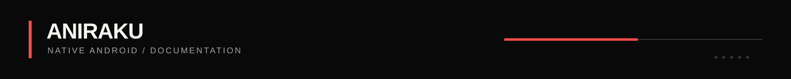

`ANIRAKU / RELEASE SIGNAL`

# Changelog

This is the public record of meaningful native Android releases. For the currently installable build, open [GitHub Releases](https://github.com/Aniraku/Aniraku-App/releases/latest).

## v2.0.Alpha — New package identity

`CURRENT / STANDARD RELEASE / ANDROID 9+ / ARM32 + ARM64`

- Migrates the Android application identity from `aniraku.anine.app` to `aniraku.anime.app`.
- Requires removal of the legacy alpha before installation; Android treats the new package as a separate app.
- Carries forward native playback continuity correction, direct quality selection, bounded forward preload, faster source startup, and the compact Nothing OS-inspired player surface.
- Publishes the universal release APK through GitHub and the public Orion Store path.

## v1.8.Alpha — Playback control and preload

- Added direct in-player quality selection for provider-supplied variants such as 1080p, 720p, and 480p.
- Increased bounded forward media preload to 45 seconds without deliberately delaying initial playback.

## v1.7.Alpha — Rebuffer continuity

- Added native rebuffer-resume correction to prevent an eligible buffering recovery from visibly replaying a prior frame.

## v1.0.Alpha — Native foundation

- Replaced the prior wrapper approach with a native Android application built with Expo and React Native.
- Shipped discovery, account synchronization, native playback coordination, library functions, and direct-distribution release tooling.

---

`SIGNAL / CURRENT BUILD FIRST`

[README](./README.md) · [Latest release](https://github.com/Aniraku/Aniraku-App/releases/latest) · [Security](./SECURITY.md) · [Contributing](./CONTRIBUTING.md)
