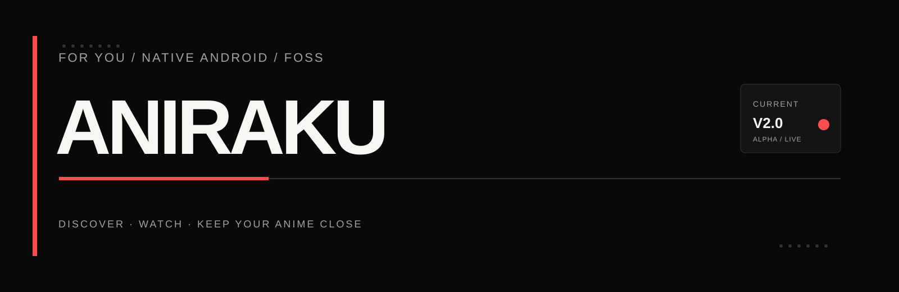

  <strong>THE APP-STYLE DOWNLOAD EXPERIENCE LIVES HERE</strong>

  <a href="https://aniraku.github.io/Aniraku-App/"><strong>aniraku.github.io/Aniraku-App →</strong></a>

  <a href="https://aniraku.github.io/Aniraku-App/">OPEN ANIRAKU SITE</a>
  &nbsp;·&nbsp;
  <a href="https://github.com/Aniraku/Aniraku-App/releases/latest">DOWNLOAD APK</a>
  &nbsp;·&nbsp;
  <a href="https://rookieenough.github.io/Orion-Data/redirect.html?id=aniraku">ORION STORE</a>

  

> **Native Android · Android 9+ · ARM32 + ARM64 · FOSS direct distribution**

## Start on the site, not in the README

**[Open the live Aniraku product site →](https://aniraku.github.io/Aniraku-App/)** for the real app-inspired experience: native screenshots, player system, direct APK installation, Orion Store access, compatibility, privacy, and trust information. This repository remains the open source for the Android client and its releases.

| `APP SITE` | `CURRENT DOWNLOAD` | `PROJECT` |
| --- | --- | --- |
| [aniraku.github.io/Aniraku-App](https://aniraku.github.io/Aniraku-App/) | [Latest GitHub Release](https://github.com/Aniraku/Aniraku-App/releases/latest) · [Orion Store](https://rookieenough.github.io/Orion-Data/redirect.html?id=aniraku) | [Architecture](./docs/NATIVE_ARCHITECTURE.md) · [Privacy](./PRIVACY.md) · [Terms](./TERMS.md) · [Security](./SECURITY.md) |

## Current Android identity

The current standard release is **v2.0.Alpha**, package `aniraku.anime.app`. If you have a legacy alpha installed under `aniraku.anine.app`, uninstall it before installing v2.0.Alpha because Android treats the package migration as a separate app.

The backend runs on a free cloud instance, so source discovery can take longer during peak demand and third-party provider availability can vary. Use Aniraku only for media you are authorized to access.

`ANIRAKU / KEEP YOUR ANIME CLOSE.`
