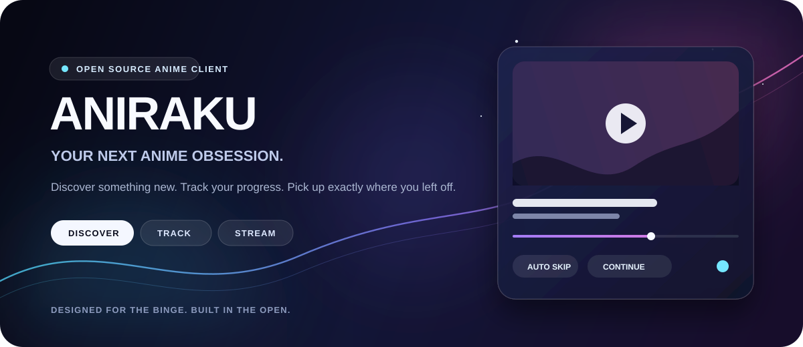

<p align="center">
  
</p>

<p align="center">
  <a href="https://www.aniraku.tech/"><strong>Open Aniraku</strong></a>
  &nbsp;&nbsp;·&nbsp;&nbsp;
  <a href="https://github.com/Aniraku/Aniraku"><strong>Web source</strong></a>
  &nbsp;&nbsp;·&nbsp;&nbsp;
  <a href="https://github.com/Aniraku/Aniraku-Backend"><strong>Backend</strong></a>
</p>

# Aniraku for Android

**Aniraku for Android** is the official native Android delivery of the Aniraku experience. It packages the maintained React frontend with Capacitor so that browsing, authentication, playback, history, ratings, comments, bookmarks, catalog filters, schedules, and account settings stay aligned with [Aniraku.tech](https://www.aniraku.tech/).

The application uses a restrained **Material 3 × Nothing OS** design layer for Android: monochrome surfaces, rounded adaptive navigation, touch-first feedback, safe-area-aware layouts, offline visibility, native system-back behavior, deep links, and an Android launcher/splash treatment based on the existing Aniraku mark. It is not a reduced web-view product; the frontend bundle is built from the same feature surface maintained for Aniraku.

| Layer | Technology | Purpose |
|---|---|---|
| Application interface | React 18, Vite, styled-components | Shared Aniraku features, responsive routes, and web UI |
| Playback | Artplayer, HLS.js, dash.js | Adaptive streams, native media, HLS, DASH, quality, subtitles, and failover |
| Native Android bridge | Capacitor 8 | Android app lifecycle, system back, keyboard resize, status bar, splash, connectivity, and deep links |
| Account and sync | Supabase | Authentication, profiles, history, ratings, bookmarks, comments, and notifications |
| Metadata and playback services | AniList and Aniraku Backend | Discovery, schedules, title metadata, providers, and playback coordination |

## Feature parity

The Android application retains the public Aniraku user flows rather than creating a parallel product. Native enhancements sit around those flows and do not replace their data models or service contracts.

| Area | Included capability |
|---|---|
| Authentication | Sign in, sign up, verified-email protection, password recovery, session cleanup, profile, and account deletion flows |
| Discovery | Home, catalog search and filters, schedule, title details, recommendations, and minimal random discovery |
| Playback | SUB/DUB selection, provider choices, adaptive quality, HLS/DASH/native routing, intro/outro behavior, auto-next, subtitles, and playback controls |
| Personal library | Continue Watching, progress sync, episode history, ratings, bookmarks, rewatch states, and profile settings |
| Community | Comments, episode ratings, notifications, legal pages, policy pages, and reporting links |
| Android behavior | Native back navigation, offline state feedback, deep links, edge-to-edge safe areas, keyboard resizing, adaptive launcher icon, and splash screen |

## Android design system

The Android-only design layer is activated by the Capacitor runtime and leaves browser deployments unchanged. It applies a Material 3-inspired surface hierarchy with Nothing OS restraint: high-contrast dark surfaces, clear type, soft 12–28 px shape tokens, monochrome selection states, and compact rounded navigation designed for one-handed use.

> **Design principle:** Android should feel native in posture and feedback, while the content and account experience remain recognizably Aniraku.

The native shell also suppresses Vercel browser analytics components inside the APK. That prevents web-only analytics loading messages from cluttering Android diagnostics without removing analytics from the website.

## Architecture

```text
Android device
  │
  ├── Capacitor Android shell
  │   ├── Status bar, splash, keyboard, network, app lifecycle
  │   ├── aniraku:// deep links
  │   └── Material 3 / Nothing OS Android-only styling
  │
  └── Bundled Aniraku React application
      ├── Supabase authentication and synchronized library data
      ├── AniList metadata, catalog, schedules, and discovery
      ├── Artplayer, HLS.js, dash.js, and provider selection
      └── Aniraku Backend playback and source coordination
```

## Requirements

A local Android release build requires Node.js 22 or newer, Java 21, Android SDK Platform 36, Android Build Tools 36.0.0, and an Android device running Android 7.0 (API 24) or newer. Capacitor 8 uses API 24 as its minimum Android level. The release APK is a single, signed, ABI-neutral Java/WebView package rather than an ABI-split binary, so it is suitable for supported 32-bit and 64-bit Android environments where the system WebView is available; the matching App Bundle lets Google Play optimize delivery per device.

```bash
node --version
java -version
```

## Local development

Install dependencies and run the same browser application used by the website.

```bash
git clone https://github.com/Aniraku/Aniraku-App.git
cd Aniraku-App
npm install
npm run dev
```

Build the web bundle and synchronize it into the Android project whenever frontend code changes.

```bash
npm run android:sync
```

The available commands are organized below.

| Command | Purpose |
|---|---|
| `npm run dev` | Run Aniraku in Vite development mode. |
| `npm run lint` | Validate maintained source files. Generated Android assets are intentionally excluded. |
| `npm run build` | Produce the production web bundle. |
| `npm run test:bots` | Run existing browser smoke checks. |
| `npm run test:e2e` | Run the Playwright cross-device regression suite. |
| `npm run android:sync` | Build the web bundle and copy it into `android/`. |
| `npm run android:debug` | Build an installable debug APK. |
| `npm run android:release` | Build a signed release APK when local signing material is configured. |
| `npm run android:open` | Open the generated Android project in Android Studio. |

## Signing and release safety

Android publishing requires one stable signing key. The key identifies future app updates; losing it prevents updates from being accepted as upgrades to the existing application.

The repository deliberately ignores these private files:

```text
android/keystore.properties
android/app/aniraku-release.jks
android/local.properties
```

Copy `android/keystore.properties.example` to `android/keystore.properties`, set strong local credentials, and store the matching keystore in a secure password manager or encrypted backup. Never commit either file. A signed release build is generated with:

```bash
npm run android:release
```

The resulting artifact is normally written to:

```text
android/app/build/outputs/apk/release/app-release.apk
```

For Google Play distribution, build an Android App Bundle after synchronization:

```bash
cd android
./gradlew bundleRelease
```

## Validation standard

Before publishing a release, run the following sequence after a clean synchronization:

```bash
npm run lint
npm run build
npm run test:bots
npm run test:e2e
npm run android:sync
cd android && ./gradlew lintRelease assembleRelease
```

The release process also verifies the APK package name, version, signature, alignment, and archive contents. A physical-device check should cover sign-in, password recovery, catalog search, title navigation, mobile search, watch playback, provider changes, system back, keyboard behavior, deep links, and offline feedback.

## Repository boundaries

This repository contains the Android wrapper and the bundled Aniraku frontend source. The separate repositories remain the source of truth for their respective services:

| Repository | Responsibility |
|---|---|
| [`Aniraku/Aniraku`](https://github.com/Aniraku/Aniraku) | Web frontend and Vercel deployment |
| [`Aniraku/Aniraku-Backend`](https://github.com/Aniraku/Aniraku-Backend) | Playback resolution and backend API |
| [`Aniraku/Aniraku-App`](https://github.com/Aniraku/Aniraku-App) | Android native packaging, Android design layer, signed release configuration, and APK artifacts |

## Content, privacy, and legal notices

Aniraku is an open-source discovery and playback client. Anime artwork, metadata, provider pages, streamed media, trademarks, and third-party services remain subject to their respective rights, terms, and policies. See the included [Privacy Policy](PRIVACY_POLICY.md), [Terms](docs/TERMS.md) where applicable, and [DMCA route](https://www.aniraku.tech/dmca) for service-level notices.

## License

This repository is distributed under the included [MIT License](LICENSE). Capacitor and the other dependencies retain their own licenses.

<p align="center">
  <strong>Find it. Watch it. Keep your place.</strong><br />
  <sub>Android-ready, feature-complete, and built with care by the Aniraku community.</sub>
</p>
