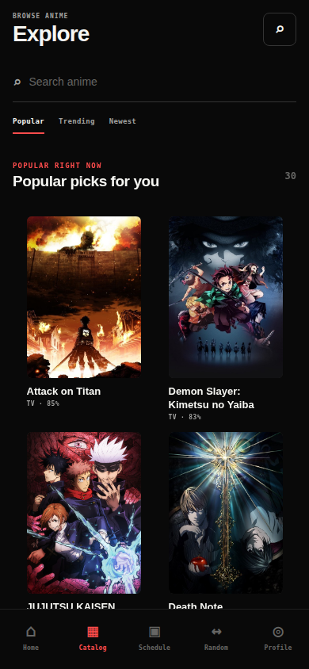
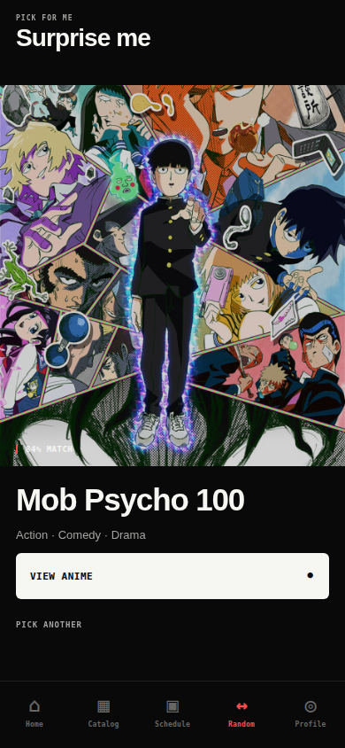
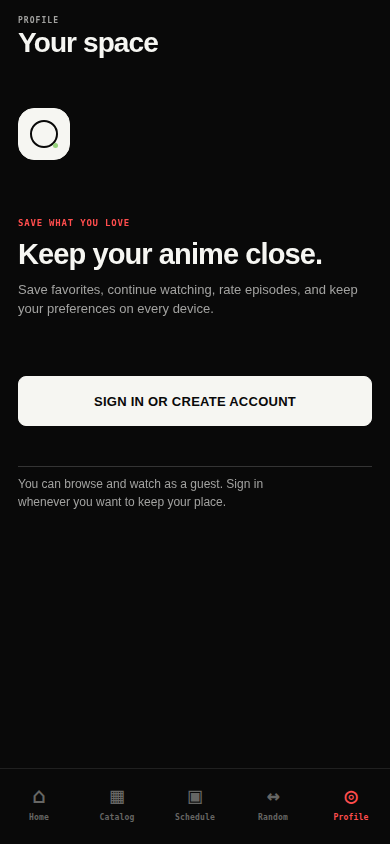

# ANIRAKU / NATIVE ANDROID

`FOR YOU  ·  ANDROID 9+  ·  DIRECT INSTALL  ·  FOSS`


> **A native Android companion for discovering anime, resuming episodes, and keeping a personal library in sync.**

Aniraku is a real **Expo / React Native** application, not a website container. Its interface is built around the same language used in the app: near-black surfaces, soft white type, graphite dividers, compact mono labels, and one signal-red accent. The result is deliberately quiet when browsing and direct when it is time to watch.

`█ SIGNAL / ANIRAKU` `██████████████████████████████████` `ONLINE`

## THE INTERFACE

Every image below is a **real capture from the implemented Aniraku application**. No generated UI artwork or fabricated product screens are used here.

| `BROWSE / EXPLORE` | `PICK / SURPRISE ME` |
| :---: | :---: |
|  |  |
| `Search, trend switches, and poster-led discovery.` | `A minimal one-tap route to something new.` |

| `WATCH / REAL DEVICE` | `PROFILE / YOUR SPACE` |
| :---: | :---: |
|  |  |
| `Native controls, episode context, and source state.` | `A focused entry point for your synced library.` |

## WHAT IS INSIDE

| `SYSTEM` | `ANIRAKU BEHAVIOR` |
| --- | --- |
| `DISCOVER` | Home, Catalog, full-text title search, release schedule, title detail, and a random-pick flow. |
| `WATCH` | Backend-led provider discovery, direct media and proxy recovery, compatible embedded-provider fallback, language/provider selection, quality choices, resume, auto-next, AniSkip, speed, subtitles, and 10-second seek. |
| `LIBRARY` | Watch history, bookmarks, per-episode ratings, comments, in-app release alerts, and synchronized settings. |
| `ACCOUNT` | Email verification, password recovery, encrypted local session storage, avatar selection, and account deletion. |
| `ANDROID` | A native player using `expo-video`, landscape fullscreen, Picture-in-Picture support, safe areas, haptics, and deep links. |

`PLAYBACK RULE / DIRECT SOURCE → ANIRAKU PROXY → VERIFIED EMBED`

The Watch flow follows the Aniraku source coordinator. It asks the backend for the canonical episode and compatible servers, tries native delivery before a verified embed, keeps the selected episode while discovery continues, and avoids remounting a stream that has already begun playing.

## GET IT

Download the current signed APK from the [GitHub Releases page](https://github.com/Aniraku/Aniraku-App/releases/latest). Aniraku is distributed directly; it is **not** published through Google Play.

| `STEP` | `INSTALL` |
| --- | --- |
| `01 / DOWNLOAD` | Open the latest release and download the `.apk` file for **Aniraku**. |
| `02 / ALLOW` | If Android asks, allow your browser or file manager to install apps from this source. |
| `03 / INSTALL` | Open the completed APK and confirm installation. Existing compatible Aniraku installs can update in place when signed with the same release key. |
| `04 / OPEN` | Sign in to sync your library, or browse as a guest. |

> **Compatibility:** the public configuration targets Android 9 / API 28 and later, with both `armeabi-v7a` and `arm64-v8a` native libraries included.

## RUN IT LOCALLY

The project uses Node.js 22 and pnpm 9. Install dependencies, set public runtime values, then run the checks before opening Android.

```bash
pnpm install
pnpm check
pnpm test
pnpm android
```

| `PUBLIC VARIABLE` | `USED FOR` |
| --- | --- |
| `EXPO_PUBLIC_API_BASE_URL` | Aniraku API origin, normally `https://api.aniraku.tech`. |
| `EXPO_PUBLIC_ANILIST_GRAPHQL_URL` | AniList GraphQL endpoint for discovery metadata. |
| `EXPO_PUBLIC_SUPABASE_URL` | The Aniraku Supabase project URL. |
| `EXPO_PUBLIC_SUPABASE_ANON_KEY` | The client-safe Supabase anonymous/publishable key. |

`DO NOT COMMIT` service-role keys, provider credentials, database passwords, or signing keys.

## NATIVE STACK

| `LAYER` | `CHOICE` |
| --- | --- |
| `UI` | [React Native](https://reactnative.dev/) 0.81, [Expo](https://expo.dev/) SDK 54, [Expo Router](https://docs.expo.dev/router/introduction/) 6, and TypeScript. |
| `DATA` | [TanStack Query](https://tanstack.com/query/latest), the [AniList GraphQL API](https://anilist.gitbook.io/anilist-apiv2-docs/), and Supabase. |
| `MEDIA` | [expo-video](https://docs.expo.dev/versions/latest/sdk/video/), `react-native-webview`, Screen Orientation, and native Picture-in-Picture configuration. |
| `QUALITY` | TypeScript checking, Vitest regression coverage, GitHub Actions, and signed Android release artifacts. |

## PROJECT MAP

| `FILE` | `PURPOSE` |
| --- | --- |
| [`app/`](./app) | File-based native screens and navigation. |
| [`app/watch/[id].tsx`](./app/watch/%5Bid%5D.tsx) | Native Watch experience, player coordination, recovery, and episode actions. |
| [`lib/`](./lib) | Aniraku API, AniList, Supabase, player, and app configuration clients. |
| [`tests/`](./tests) | Deterministic behavior and regression coverage. |
| [`.github/workflows/`](./.github/workflows) | Continuous integration checks. |

## PROJECT DOCUMENTS

| `READ` | `SCOPE` |
| --- | --- |
| [Architecture](./docs/NATIVE_ARCHITECTURE.md) | Service boundaries, domain model, session security, and playback responsibilities. |
| [Privacy](./PRIVACY.md) | Data categories, retention, deletion behavior, and user controls. |
| [Terms](./TERMS.md) | Acceptable use, source responsibilities, and service limitations. |
| [DMCA](./DMCA.md) | Copyright notice procedure and repeat-infringer policy. |
| [Security](./SECURITY.md) | Reporting route and client security expectations. |
| [Contributing](./CONTRIBUTING.md) | Development and pull-request expectations. |
| [Changelog](./CHANGELOG.md) | Release notes and version history. |

## RESPECT THE SIGNAL

Use Aniraku only for media you are authorized to access. Anime titles, artwork, provider content, trademarks, and related materials belong to their respective owners and remain subject to their terms. The project is available under the [MIT License](./LICENSE).

`ANIRAKU / KEEP YOUR ANIME CLOSE.`
