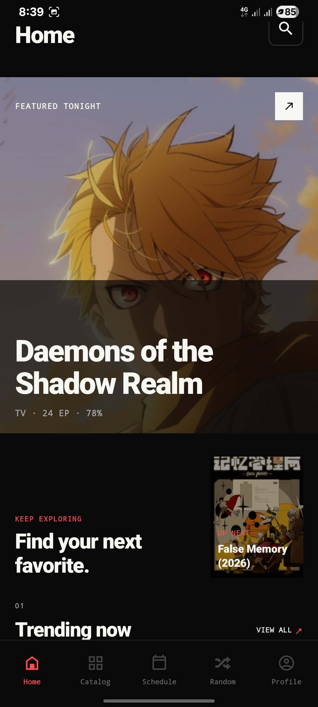
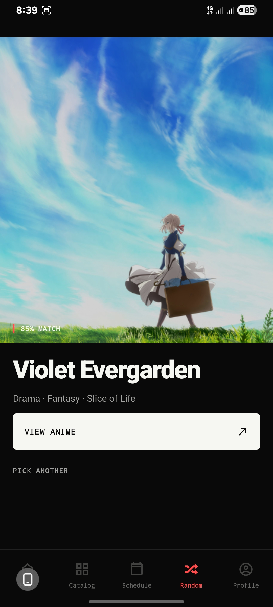

<p align="center">
  <strong>Native Android anime discovery, playback, and library—built for people who want their watchlist close.</strong>
</p>

<p align="center">
  <a href="https://github.com/Aniraku/Aniraku-App/releases/latest">DOWNLOAD v2.0.ALPHA</a>
  &nbsp;·&nbsp;
  <a href="https://rookieenough.github.io/Orion-Data/redirect.html?id=aniraku">GET IT ON ORION STORE</a>
  &nbsp;·&nbsp;
  <a href="https://aniraku.tech">OPEN ANIRAKU</a>
</p>

<p align="center">
  <a href="https://rookieenough.github.io/Orion-Data/redirect.html?id=aniraku"></a>
</p>

`FOR YOU / ANDROID 9+ / ARM32 + ARM64 / FOSS / DIRECT INSTALL`

---

## ONE LIBRARY. ONE SIGNAL.

Aniraku is a real **Expo / React Native Android application**, not a website container. It turns discovery, episode progress, provider choice, and your personal library into one quiet native surface: near-black canvas, soft-white reading order, graphite rules, and one signal-red action state.

| `START HERE` | `KEEP GOING` | `TAKE A CHANCE` |
| :--- | :--- | :--- |
| Browse the latest releases and resume the episode already in motion. | Search a catalog built around artwork, seasons, status, and title. | Let Aniraku surface one title worth trying now. |
| [Open the latest release](https://github.com/Aniraku/Aniraku-App/releases/latest) | [Read the architecture](./docs/NATIVE_ARCHITECTURE.md) | [See the real Random screen](#a-real-native-surface) |

> **v2.0.Alpha changes the Android package to `aniraku.anime.app`.** Uninstall any legacy `aniraku.anine.app` alpha before installing this release. Android treats the package migration as a separate app, and uninstalling the legacy app removes its local data.

---

## A REAL NATIVE SURFACE

These are real captures from the implemented application—not generated product art. The artwork carries the emotion; the interface stays quiet enough to make a next action obvious.

| `01 / HOME` | `02 / CATALOG` |
| :---: | :---: |
|  |  |
| A single continue-or-discover moment, followed by paced release rails. | A deliberate poster gallery with search and discovery controls. |

| `03 / WATCH` | `04 / RANDOM` |
| :---: | :---: |
|  |  |
| Direct media first, proxy recovery when required, verified embeds only as a last path. | One title, one fact line, one decisive way to begin. |

---

## WHAT MOVES WITH YOU

| `DISCOVER` | `WATCH` |
| :--- | :--- |
| Home, Catalog, title search, schedule, detail pages, and a one-tap Random route use AniList discovery data with honest loading and recovery states. | The native Watch route coordinates backend-reported servers, language tracks, quality options, resume progress, auto-next, AniSkip, subtitles, speed, fullscreen, and Picture-in-Picture. |
| `KEEP` | `CONNECT` |
| Watch history, bookmarks, ratings, comments, episode progress, and in-app alerts create a library that stays personal instead of becoming a dashboard. | Optional verified-email accounts use Supabase-backed synchronization, encrypted native session storage, recovery, avatar selection, and account deletion. |

`PLAYBACK ORDER / DIRECT SOURCE → ANIRAKU PROXY → VERIFIED EMBED`

The player does not switch the episode simply because a source is still being resolved. It preserves the selected episode while the Aniraku coordinator discovers compatible options, prevents an already-started stream from being unnecessarily remounted, and exposes audio/provider controls inside the media plane.

---

## GET THE SIGNAL

| `01 / DOWNLOAD` | `02 / ALLOW` | `03 / INSTALL` | `04 / OPEN` |
| :--- | :--- | :--- | :--- |
| Download the current `.apk` from [GitHub Releases](https://github.com/Aniraku/Aniraku-App/releases/latest) or [Orion Store](https://rookieenough.github.io/Orion-Data/redirect.html?id=aniraku). | If Android asks, allow your browser or file manager to install applications from this source. | Open the completed APK. For v2.0.Alpha, remove the legacy `aniraku.anine.app` install first. | Browse as a guest or sign in to keep your library in sync. |

| `COMPATIBILITY` | `CURRENT IDENTITY` | `DISTRIBUTION` |
| :--- | :--- | :--- |
| Android 9 / API 28 and later, with `armeabi-v7a` and `arm64-v8a` libraries. | `aniraku.anime.app` · `v2.0.Alpha` | FOSS direct distribution. No Google Play listing. |

The backend runs on a free cloud instance. During peak demand, source discovery may take a little longer; a provider appearing in the app is not a guarantee of uninterrupted third-party availability. If you can support infrastructure costs, start with the [project page](https://github.com/Aniraku/Aniraku-App).

---

## BUILT NATIVE, KEPT OPEN

| `LAYER` | `CHOICE` |
| --- | --- |
| Interface | React Native 0.81, Expo SDK 54, Expo Router 6, TypeScript, and a Nothing OS-inspired design system. |
| Data | AniList for discovery metadata, `api.aniraku.tech` for playback coordination, Supabase for optional account-scoped synchronization. |
| Media | `expo-video`, Android-native fullscreen/Picture-in-Picture configuration, Screen Orientation, and WebView only for verified embed fallbacks. |
| Quality | TypeScript checks, Vitest regression coverage, GitHub Actions, and a universal Android release artifact. |

### Run it locally

```bash
pnpm install
pnpm check
pnpm test
pnpm android
```

| `PUBLIC VARIABLE` | `USED FOR` |
| --- | --- |
| `EXPO_PUBLIC_API_BASE_URL` | The Aniraku API origin, normally `https://api.aniraku.tech`. |
| `EXPO_PUBLIC_ANILIST_GRAPHQL_URL` | AniList GraphQL metadata requests. |
| `EXPO_PUBLIC_SUPABASE_URL` | The Aniraku Supabase project URL. |
| `EXPO_PUBLIC_SUPABASE_ANON_KEY` | The public, client-safe Supabase anonymous/publishable key. |

> Never commit service-role keys, signing keys, provider credentials, database passwords, or `.env` files.

---

## READ THE SYSTEM

| `PRODUCT` | `TRUST` | `BUILD` |
| :--- | :--- | :--- |
| [Native architecture](./docs/NATIVE_ARCHITECTURE.md) · [Documentation system](./docs/DOCUMENTATION_SYSTEM.md) · [Design direction](./design.md) | [Privacy](./PRIVACY.md) · [Terms](./TERMS.md) · [DMCA](./DMCA.md) · [Security](./SECURITY.md) | [Contributing](./CONTRIBUTING.md) · [Changelog](./CHANGELOG.md) · [License](./LICENSE) |

Use Aniraku only for media you are authorized to access. Anime titles, artwork, provider content, trademarks, and related materials belong to their respective owners and remain subject to their terms. The project itself is released under the [MIT License](./LICENSE).

`ANIRAKU / KEEP YOUR ANIME CLOSE.`
