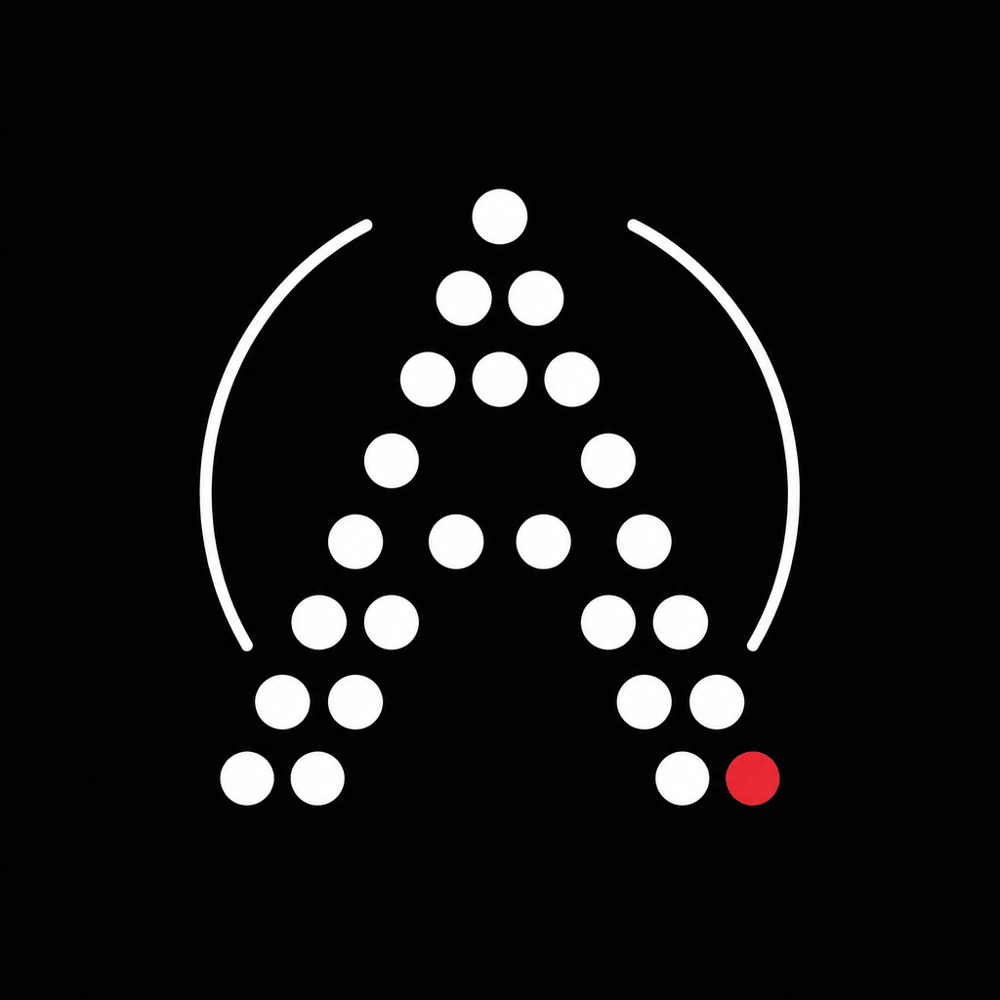
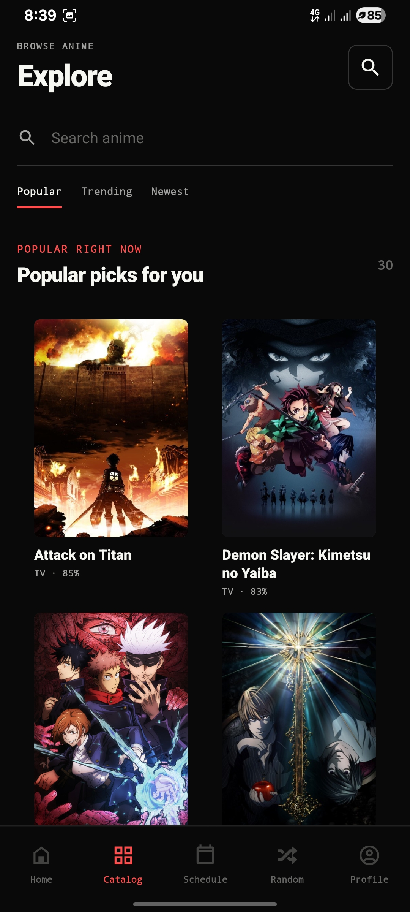
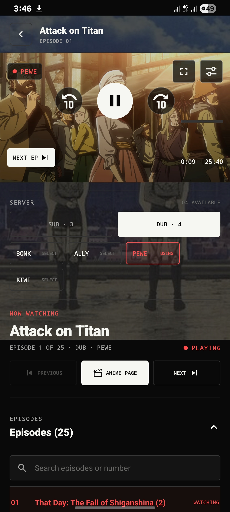
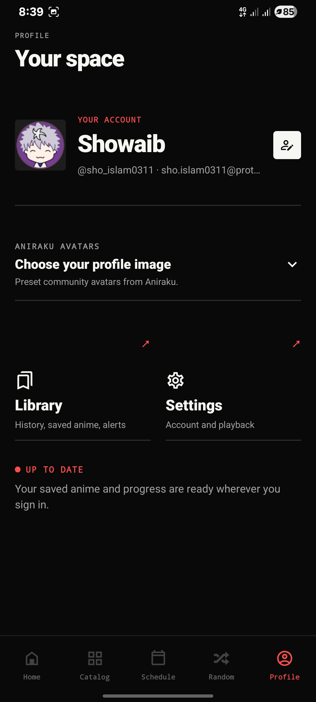
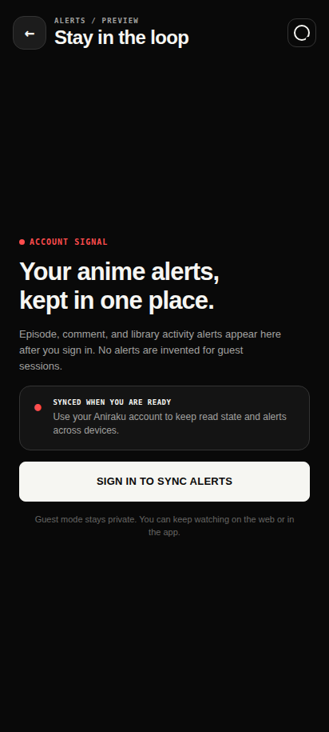

  

<h1 align="center">ANIRAKU / NATIVE ANDROID</h1>

  <strong>THE APP-STYLE DOWNLOAD EXPERIENCE LIVES HERE</strong>

  <a href="https://aniraku.github.io/Aniraku-App/"><strong>aniraku.github.io/Aniraku-App →</strong></a>

  <a href="https://aniraku.github.io/Aniraku-App/">OPEN ANIRAKU SITE</a>
  &nbsp;·&nbsp;
  <a href="https://github.com/Aniraku/Aniraku-App/releases/latest">DOWNLOAD APK</a>
  &nbsp;·&nbsp;

> **Native Android · Android 9+ · ARM32 + ARM64 · FOSS direct distribution**

## Start on the site, not in the README

**[Open the live Aniraku product site →](https://aniraku.github.io/Aniraku-App/)** for the real app-inspired experience: native screenshots, player system, direct APK installation, Orion Store access, compatibility, privacy, and trust information. This repository remains the open source for the Android client and its releases.

| `APP SITE` | `CURRENT DOWNLOAD` | `PROJECT` |
| --- | --- | --- |
| [aniraku.github.io/Aniraku-App](https://aniraku.github.io/Aniraku-App/) | [v4.2 stable](https://github.com/Aniraku/Aniraku-App/releases/tag/v4.2) · [Latest GitHub Release](https://github.com/Aniraku/Aniraku-App/releases/latest) · [Orion Store](https://rookieenough.github.io/Orion-Data/redirect.html?id=aniraku) | [Architecture](./docs/NATIVE_ARCHITECTURE.md) · [Rebuffer correction](./docs/V42_REBUFFER_CONTINUITY.md) · [Privacy](./PRIVACY.md) · [Terms](./TERMS.md) · [Security](./SECURITY.md) |

## Current Android identity

The current standard release is **v4.2**, package `aniraku.anime.app`, with **versionCode 22**. Start with the [v4.2 release page](https://github.com/Aniraku/Aniraku-App/releases/tag/v4.2) for the universal Android 9+ APK, integrity notes, and complete release notes.

v4.2 corrects the Watch-history path that could reapply an old saved position after rebuffer recovery. A persisted position now applies once only at fresh source startup, so a later ready-to-play event cannot seek backward, replay a frame, and discard the active forward buffer. The native player keeps the 120-second time-priority reserve, 20-second recovery cushion, automatic byte allocator, and storage-aware persistent cache.

v4.2 retains the native **Relationships** section, direct **Downloads** flow for eligible progressive sources, bounded **Audio & Provider** controls, provider parity, direct → proxy → verified embed recovery, AniSkip, fullscreen, and list synchronization. Adaptive HLS/DASH, embedded, DRM-protected, non-HTTPS, and unavailable sources remain streaming-only for Downloads.

AniList and MyAnimeList linking retain the protected browser-based flow used by aniraku.tech, with real provider marks, explicit status/import/export/disconnect actions, and connected progress/rating summaries. Provider client secrets and tokens are never bundled into the APK.

If you have a legacy alpha installed under `aniraku.anine.app`, uninstall it before installing v4.2 because Android treats the package migration as a separate app.

The backend runs on a free cloud instance, so source discovery can take longer during peak demand and third-party provider availability can vary. Use Aniraku only for media you are authorized to access.

## Real native screens

Every capture below comes from the implemented Aniraku application. The Profile image is a verified signed-in device capture. The Alerts image is the real guest preview, which explains the sign-in path without presenting made-up notification records.

  
  
  

  
  
  

`ANIRAKU / KEEP YOUR ANIME CLOSE.`
